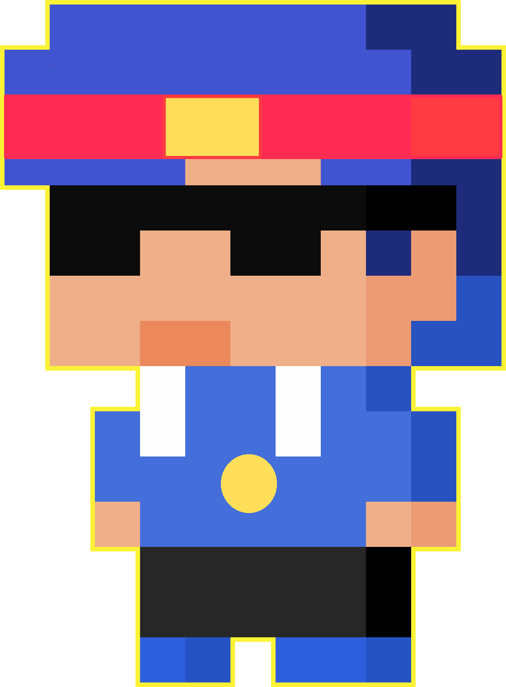

  <h1>Hi, i'm Karis 🧪</h1>
    
  
  
  

## ⭐ About me

- 🕶️ `He/him` 
- 💙 `Pixel Art` + `Plugin` + `Coding` + `Anime/Manga`
- 💻Languages I know and will improve 
     
     

  
- ⏳Languages I will learn next (perhaps) 
     
     
     

